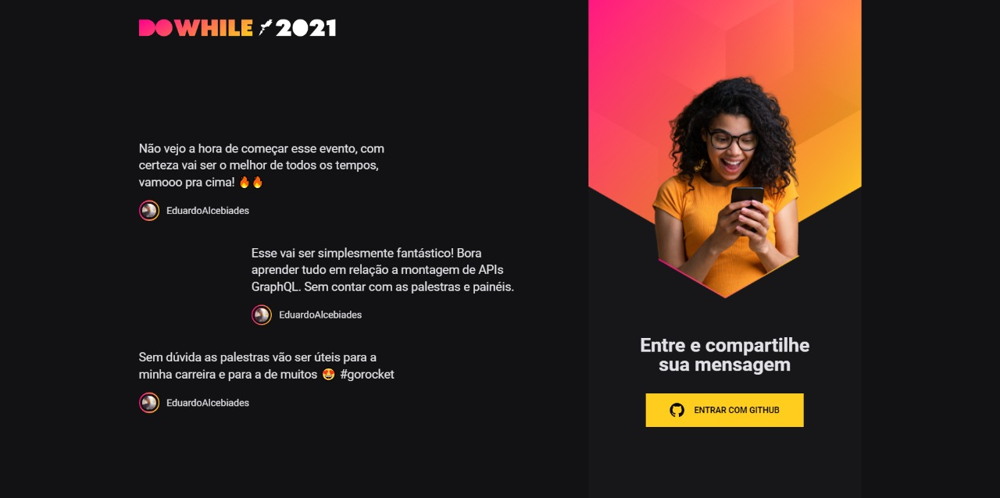
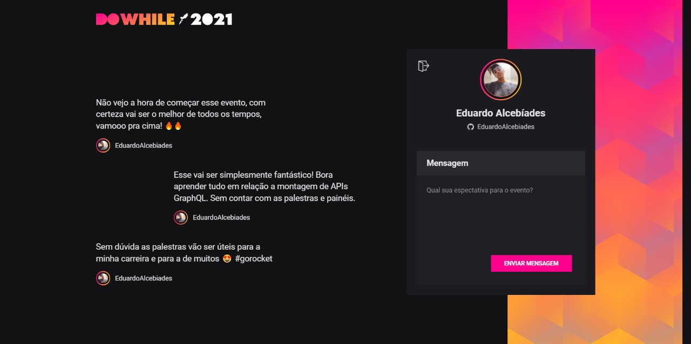

# Next Level Week 7

Na Next Level Week 7 os educadores da plataforma [RocketSeat](https://www.rocketseat.com.br) passaram a criação de um projeto chamado DoWhile 2021. Durante o curso, foi realizado a criação do Back-End em [NodeJS](https://nodejs.org/pt-br/) e Front-End utilizando React com [ViteJS](https://vitejs.dev).

# Preparando o ambiente

Para iniciar o projeto é necessário instalado em sua máquina o [NodeJS](https://nodejs.org/pt-br/). Também será necessário iniciar um **OAuth App** à partir da plataforma [GitHub](https://github.com).

# Back-End

## Dependências

```bash
$ npm install
$ npm prisma migrate dev
```

## Variáveis Ambiente

```bash
APP_PORT= (Porta para rodar o servidor)

GITHUB_CLIENT_ID= (Client ID obtido no GitHub)

GITHUB_CLIENT_SECRET= (Client Secret obtida no GitHub)

JWT_SECRET= (Sequência de caracteres aleatórios ou hash)
```

## Iniciando o servidor

```bash
$ npm run dev
```

# Front-End

## Dependências

```bash
$ npm install
```

## Variáveis Ambiente

```bash
VITE_APP_URL= (URL servidor backend. Ex: 'http://127.0.0.1:3333')

GITHUB_CLIENT_ID= (Client ID obtido no GitHub)
```

## Iniciando o servidor

```bash
$ npm run dev
```

# Prints do Projeto



